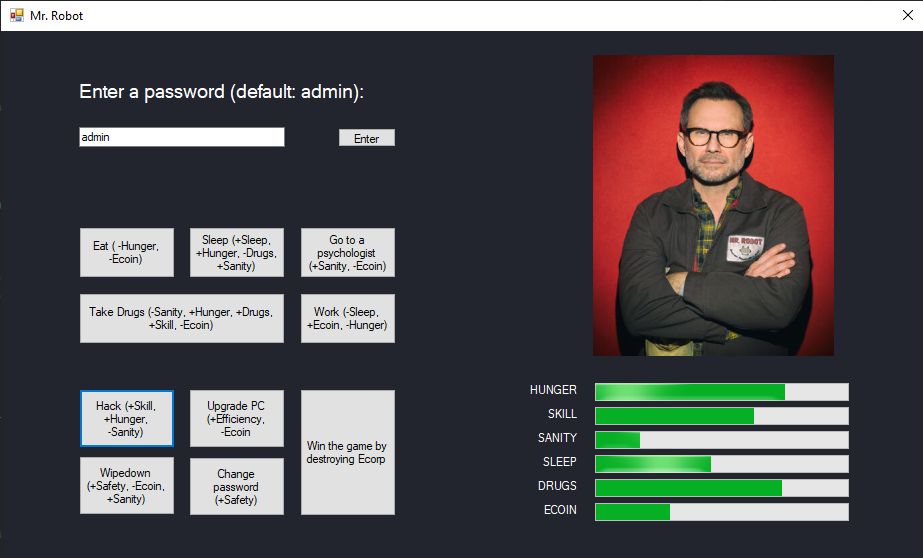
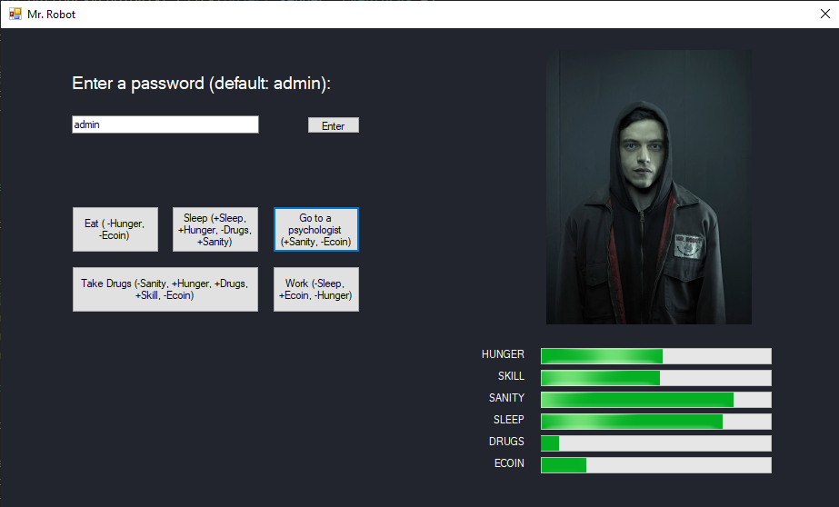

# MrRobotGame 

A C# game inspired by the cult series Mr. Robot 
I've included the sln file so you can open the project with Visual Studio.

## Kredek Lab1

This application was created as a homework for a university coding club [Kredek](https://www.facebook.com/KNKredek)

## Preview
 

  

 
 

## Description

English:

In the game we play the role of Elliot Anderson and our goal is to overcome E-corp.
To do that we firstly need to collect the necessary resources, but we also can't forget about the daily needs of our character. 
Other than that we need to remember that there is a chance we get hacked, before we can reach our goal. To avoid that we have certain mechanisms such as changing our passwords or doing a "Wipedown". To learn quicker we can upgrade our setup. If you watched the series you would also know that Elliot used to work faster under the influence of drugs, so keep that in mind. Also there is nothing for free, so you need to work to earn money. Don't forget about your mental health, visit a psychologist once a while. To win you just need to click the "Win the game by destroying Ecorp" button, but to that firstly you need to reach a certain level of programming skill, but that's not it ...  
What if the pressure is too high and Elliot will not be able to carry out his plan to the end? 
By the looks of it, you'll be needing Mr. Robot's help!  

  
Polish: 
MrRobotGame to gra oparta na kultowym już serialu Mr. Robot, w której wcielamy się w postać Elliota Andersona i naszą misją jest pokonać E-corp.

Żeby jednak to zrobić musimy najpierw zebrać potrzebne do tego umiejętności, przy czym nie możemy zapominać o codziennych czynnościach, które musimy wykonywać żeby nie umrzeć (zdrowie psychiczne i sen nie mogą osiągnąć poziomu 0, a używki i głód nie mogą osiągnąć poziomu 100). 
Oprócz tego jest szansa że zostaniemy zhakowani zanim uda nam się spełnić nasz plan więc musimy dbać o swoje bezpieczeństwo na co pozwalają opcje takie jak zmiana hasła, którą trzeba wykonywać okresowo oraz wipedown czyli całkowite wyczyszczenie danych z hardware'u. 
Oprócz nauki programowania możemy również ulepszyć swój komputer co przyspiesza proces nauki do 5 razy. Oprócz tego warto wspomnieć że Elliot szybciej uczy się pod wpływem używek. 
Nic jednak nie jest za darmo więc żeby przeżyć musimy pracować. Ze zdrowiem psychicznym możemy poradzić sobie udając się do psychologa. 

Aby zwyciężyć należy wcisnąć przycisk "Win the game by destroying Ecorp". Żeby to zrobić musimy najpierw osiągnąć odpowiedni poziom umiejętności hakowania, jednak to nie wszystko. 
Co jeśli Elliot nie poradzi sobie z presją kiedy przyjdzie ostateczny moment żeby wykonać swój plan? 
Wygląda na to że potrzebny będzie Mr. Robot! 

Przepis na wygraną: (https://dbm.org.pl/bimatrix-tlumacz-kodu-binarnego.html) 
01000001 01100010 01111001 00100000 01111010 01100001 01101101 01101001 01100101 01101110 01101001 01100011 00100000 01110011 01101001 01100101 00100000 01110111 00100000 01001101 01110010 00100000 01010010 01101111 01100010 01101111 01110100 01100001 00100000 01110111 01111001 01110011 01110100 01100001 01110010 01100011 01111010 01111001 00100000 01101111 01100100 01110010 01101111 01100010 01101001 01101110 01100001 00100000 01110011 01111010 01100011 01111010 01100101 01110011 01100011 01101001 01100001 00101100 00100000 01101111 01100100 01110000 01101111 01110111 01101001 01100101 01100100 01101110 01101001 01101111 00100000 01101110 01101001 01110011 01101011 01101001 00100000 01110011 01100001 01101110 01101001 01110100 01111001 01010011 01110100 01100001 01110100 01100101 00100000 01101001 00100000 01101111 01100100 01110000 01101111 01110111 01101001 01100101 01100100 01101110 01101001 01101111 00100000 01110111 01111001 01110011 01101111 01101011 01101001 00100000 01100100 01110010 01110101 01100111 01010011 01110100 01100001 01110100 01100101
